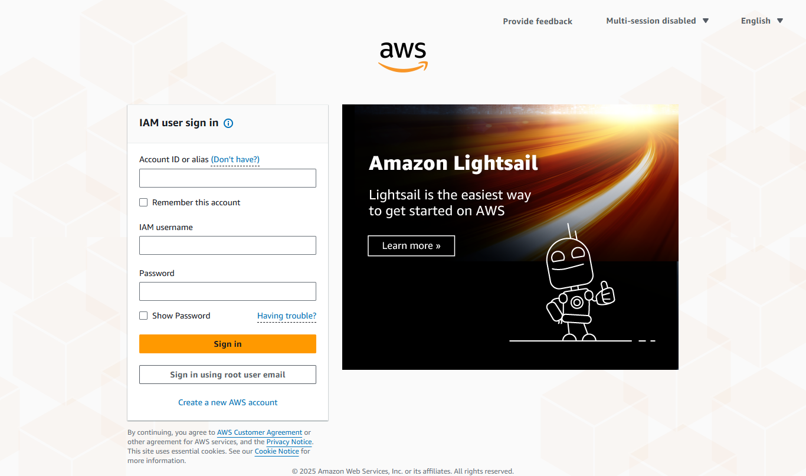
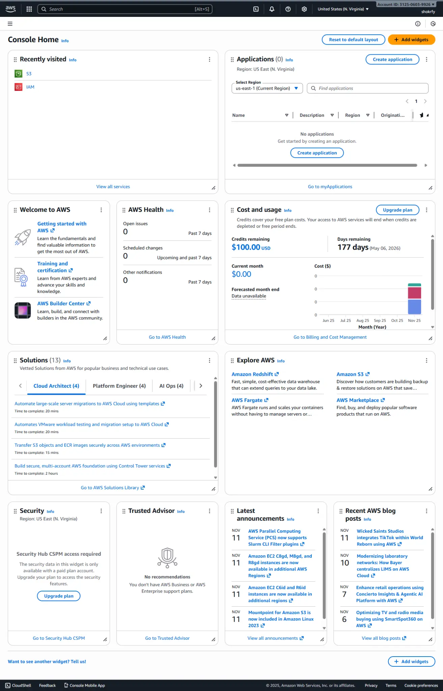
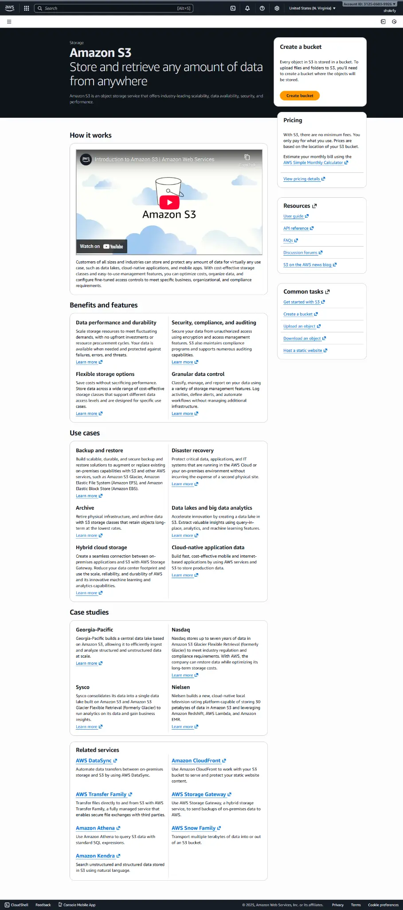
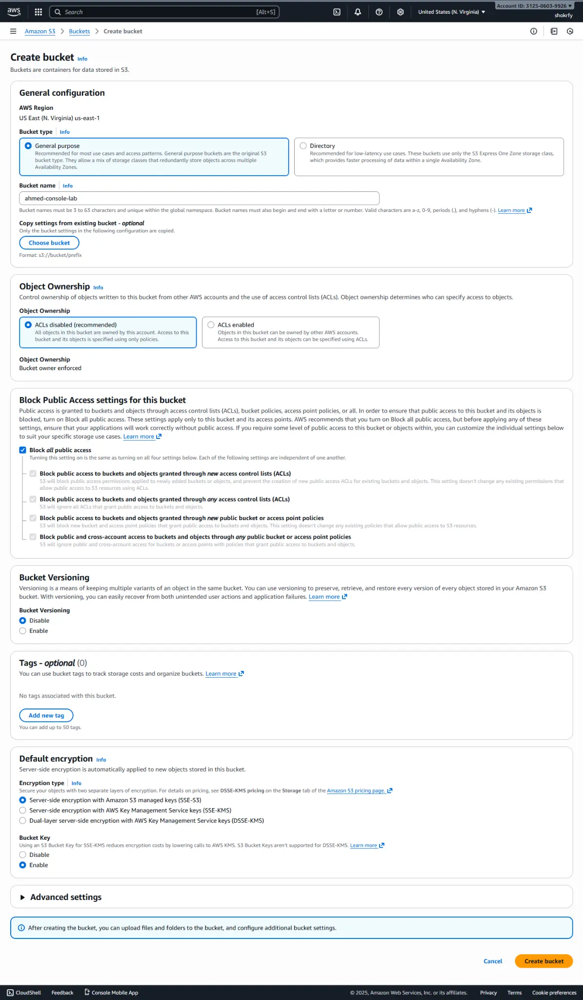
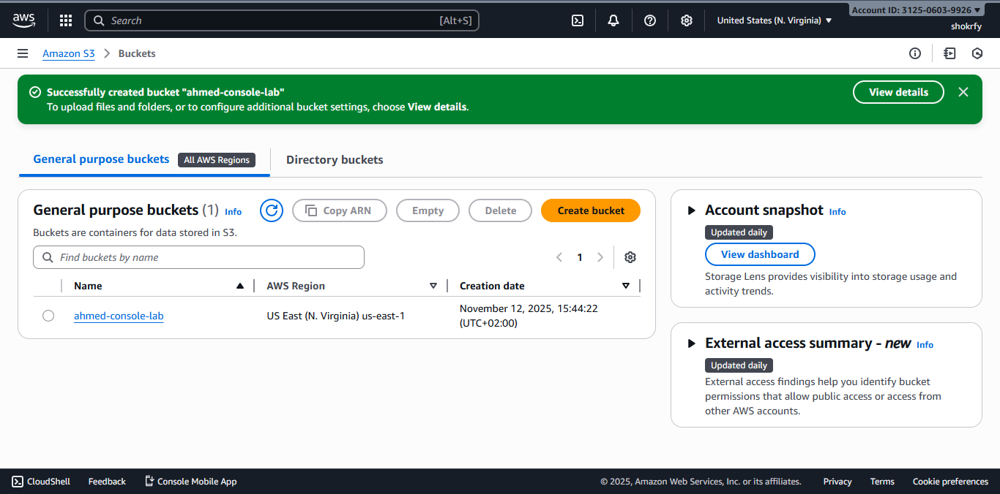
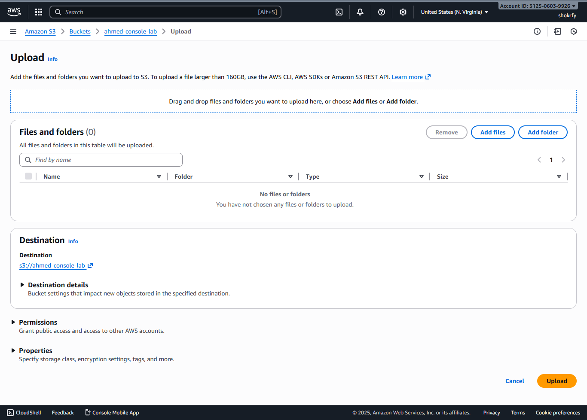
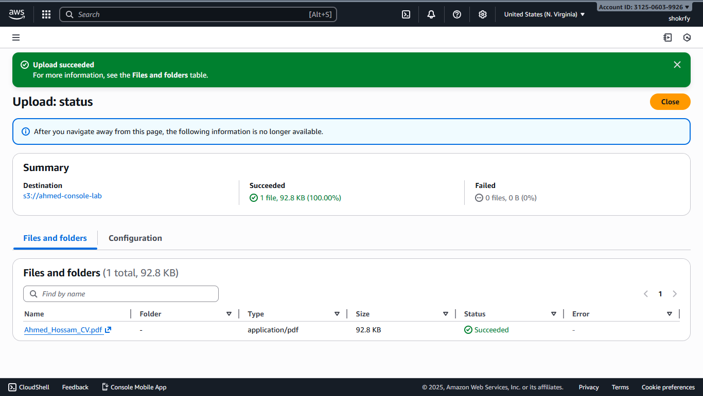
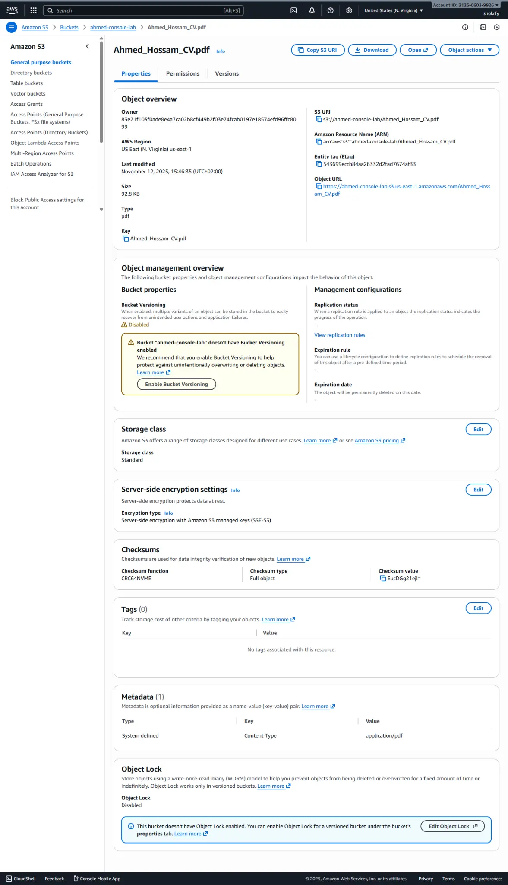

# 💻 AWS S3 Lab: Management Console (GUI)

## 🎯 Objective

Document the process of accessing the AWS Management Console, creating an S3 bucket, and uploading a file using the graphical interface, with detailed steps and visual evidence (screenshots).

---

## Step 1 – Login to AWS Console

### Description
1. Navigate to the AWS Management Console login page.
2. Enter your **IAM User Name** and **Password** to sign in.

### Screenshot

---

## Step 2 – Accessing Amazon S3

### Description
1. Upon successful login, you will be directed to the AWS Management Console Home dashboard.
2. Use the search bar at the top of the console to locate and open the **Amazon S3** service.

### Screenshots

---

## Step 3 – Creating an S3 Bucket

### Description
1. Click the **Create bucket** button on the S3 dashboard.
2. Configure the bucket settings:
   - **AWS Region:** Select your desired AWS Region (e.g., US East (N. Virginia)).
   - **Bucket Name:** Enter a globally unique name (e.g., `ahmed-console-lab`).
3. Ensure **Block all public access** is checked for security.
4. Click **Create bucket** at the bottom of the page.

### Screenshots

---

## Step 4 – Uploading the CV File

### Description
1. Click on the newly created bucket (`ahmed-console-lab`) to open its details page.
2. Click the **Upload** button.
3. On the upload page, click **Add files** and select the `Ahmed_Hossam_CV.pdf` file from your local machine.
4. Click the **Upload** button to start the transfer.

### Screenshots

---

## Step 5 – Verifying the Uploaded Object

### Description
1. Navigate back to the bucket's main page and click on the uploaded object (`Ahmed_Hossam_CV.pdf`).
2. The object details page confirms the file's properties, including the **Key** (file name), **Size**, and **Content-Type** (`application/pdf`), confirming the file is securely stored.

### Screenshot

---

## 📝 Summary and References

### Summary Table

| Operation | Tool Used | Status | Notes |
| :--- | :--- | :--- | :--- |
| **Bucket Creation** | AWS Management Console | ✅ Success | Bucket name: `ahmed-console-lab` |
| **File Upload** | AWS Management Console | ✅ Success | File: `Ahmed_Hossam_CV.pdf` |
| **Verification** | AWS Management Console | ✅ Success | Object metadata confirmed. |

### References

| Resource | Description | Link |
| :--- | :--- | :--- |
| **Amazon S3 Documentation** | Official documentation for S3 features and pricing. | [https://aws.amazon.com/s3/](https://aws.amazon.com/s3/) |
| **AWS Management Console** | Direct link to the AWS login page. | [https://aws.amazon.com/console/](https://aws.amazon.com/console/) |
