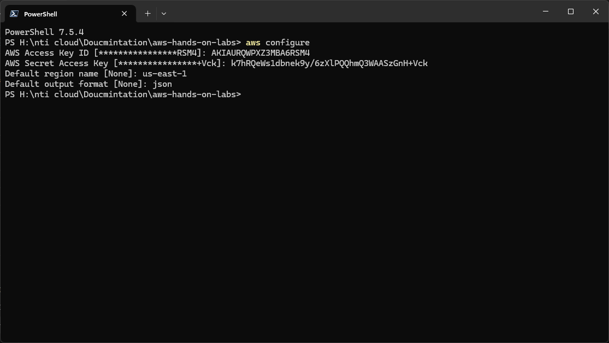
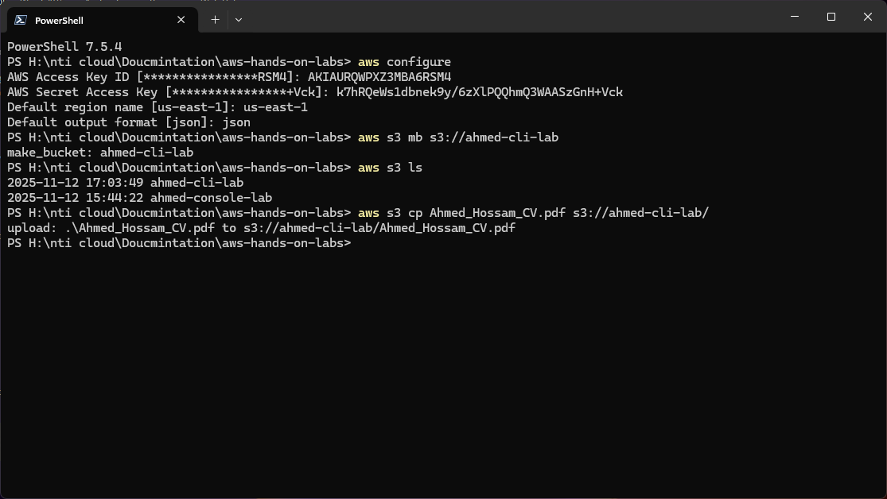
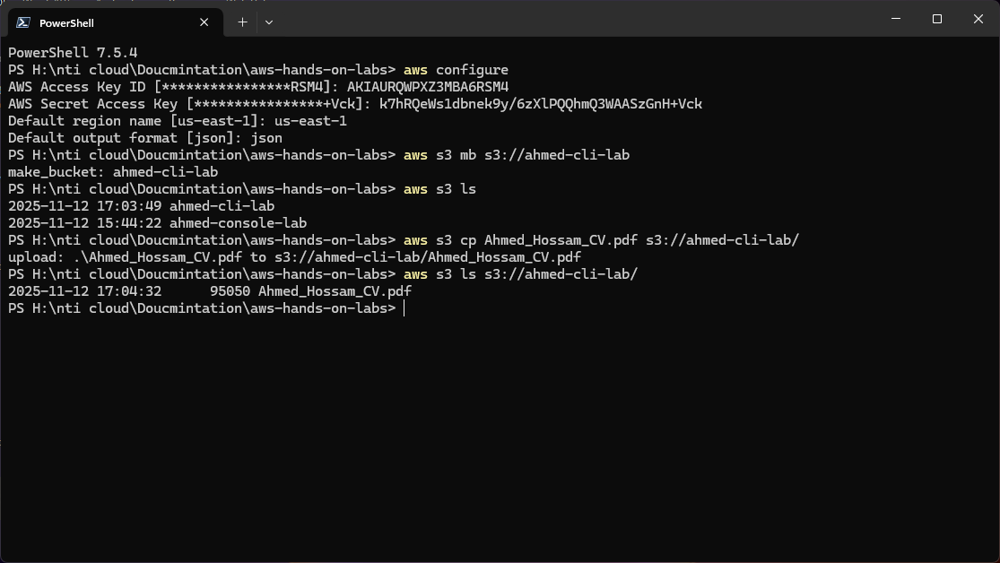

# ⚙️ AWS S3 Lab: Command Line Interface (CLI)

## 🎯 Objective

Demonstrate the use of the AWS Command Line Interface (CLI) to configure credentials, create an S3 bucket, upload a file, and verify the operation, with clear command-line output screenshots.

---

## Step 1 – Configure AWS CLI Credentials

### Description
1. The `aws configure` command is used to set up the necessary credentials for the CLI to interact with AWS services.
2. Enter your **AWS Access Key ID**, **AWS Secret Access Key**, default **Region** (`us-east-1`), and preferred **Output Format** (`json`).

### Screenshot


```bash
$ aws configure
AWS Access Key ID [****************RSM4]: AKIA...
AWS Secret Access Key [****************Vck]: k7hR...
Default region name [None]: us-east-1
Default output format [None]: json
```

---

## Step 2 – Create a New S3 Bucket

### Description
1. The `aws s3 mb` (make bucket) command is used to create a new S3 bucket.
2. The bucket name (`ahmed-cli-lab`) must be globally unique across all AWS accounts.

### Screenshot


```bash
$ aws s3 mb s3://ahmed-cli-lab
make_bucket: ahmed-cli-lab
```

---

## Step 3 – Upload the CV File

### Description
1. The `aws s3 cp` (copy) command is used to upload a local file to the specified S3 bucket.
2. The command syntax is `aws s3 cp <local_file_path> s3://<bucket_name>/`.

### Screenshot


```bash
$ aws s3 cp Ahmed_Hossam_CV.pdf s3://ahmed-cli-lab/
upload: .\Ahmed_Hossam_CV.pdf to s3://ahmed-cli-lab/Ahmed_Hossam_CV.pdf
```

---

## Step 4 – Verify the Uploaded Object

### Description
1. The `aws s3 ls` (list) command is used to list the contents of the S3 bucket.
2. The output confirms the file's presence, size, and timestamp, verifying the successful upload.

### Screenshot


```bash
$ aws s3 ls s3://ahmed-cli-lab/
2025-11-12 17:04:32      95050 Ahmed_Hossam_CV.pdf
```

---

## 📝 Summary and References

### Summary Table

| Operation | Tool Used | Command | Status |
| :--- | :--- | :--- | :--- |
| **Configuration** | AWS CLI | `aws configure` | ✅ Success |
| **Bucket Creation** | AWS CLI | `aws s3 mb` | ✅ Success |
| **File Upload** | AWS CLI | `aws s3 cp` | ✅ Success |
| **Verification** | AWS CLI | `aws s3 ls` | ✅ Success |

### References

| Resource | Description | Link |
| :--- | :--- | :--- |
| **AWS CLI Documentation** | Official documentation for installing and using the AWS CLI. | [https://aws.amazon.com/cli/](https://aws.amazon.com/cli/) |
| **S3 CLI Command Reference** | Detailed reference for all `aws s3` commands. | [https://docs.aws.amazon.com/cli/latest/reference/s3/](https://docs.aws.amazon.com/cli/latest/reference/s3/) |
