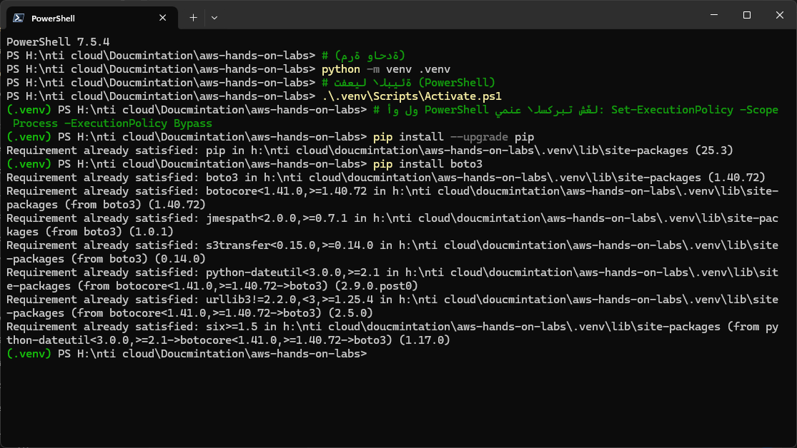
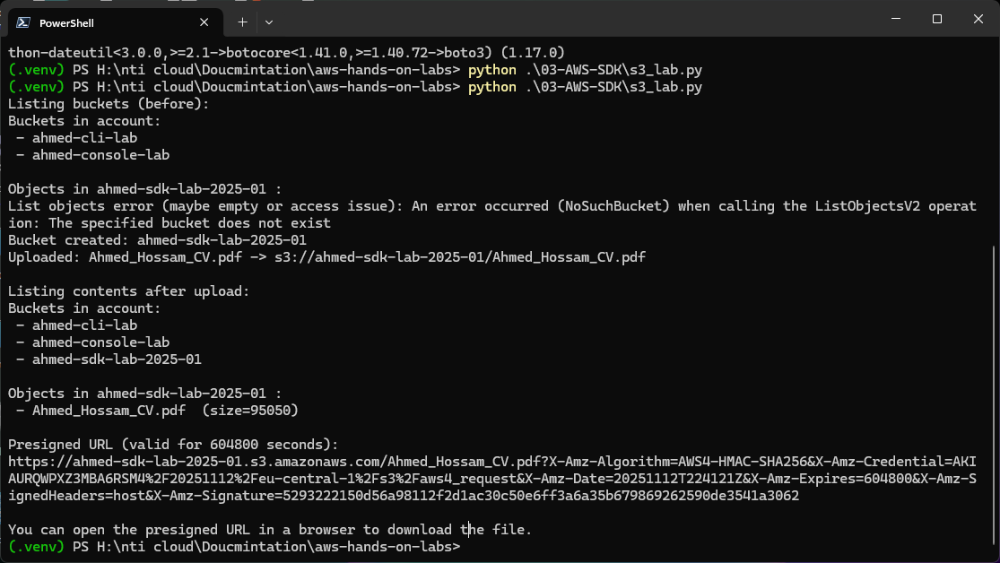
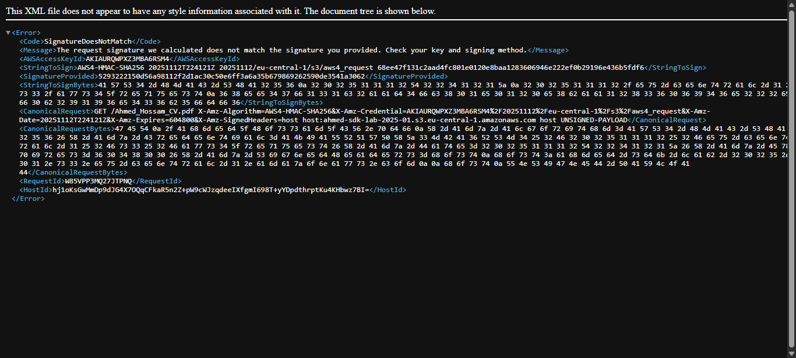

# 🐍 AWS S3 Lab: Software Development Kit (Python - Boto3)

## 🎯 Objective

Demonstrate programmatically interacting with Amazon S3 using the AWS SDK for Python (Boto3) to create a bucket, upload a file, and generate a secure pre-signed URL.

---

## Step 1 – Setup and Boto3 Installation

### Description
1. The Boto3 library is the official AWS SDK for Python and must be installed in the environment.
2. It is recommended to use a virtual environment (`venv`) for dependency management.

### Screenshot


```bash
# Assuming a virtual environment is active
$ pip install boto3
```

---

## Step 2 – Review the Python Script (`s3_lab.py`)

### Description
The lab utilizes a Python script (`s3_lab.py`) that performs the following sequence of S3 operations:
1. Initializes the S3 client using credentials configured in the environment.
2. Lists existing buckets.
3. Creates a new bucket (`ahmed-sdk-lab-2025-01`).
4. Uploads the `Ahmed_Hossam_CV.pdf` file to the new bucket.
5. Verifies the upload by listing objects in the bucket.
6. Generates a time-limited pre-signed URL for secure access to the uploaded file.

### Code Snippet
```python
import boto3
import os
# ... (rest of the imports and configuration)

# Initialize S3 client
s3_client = boto3.client('s3', region_name=REGION)

# ... (functions for create_bucket, upload_file, list_objects, generate_presigned_url)

if __name__ == "__main__":
    # 1. List existing buckets
    list_buckets()
    # 2. Create a new bucket
    create_bucket(BUCKET_NAME, REGION)
    # 3. Upload the CV file
    upload_file(f"../{FILE_TO_UPLOAD}", BUCKET_NAME)
    # 4. Verify the upload by listing objects
    list_objects(BUCKET_NAME)
    # 5. Generate a presigned URL
    generate_presigned_url(BUCKET_NAME, FILE_TO_UPLOAD)
```

---

## Step 3 – Execute the Script and Verify Output

### Description
1. Execute the Python script from the terminal.
2. The output confirms the successful creation of the bucket, the upload of the file, and the generation of the pre-signed URL.

### Screenshot


```bash
$ python s3_lab.py
--- AWS SDK (Python - Boto3) Lab Execution ---
# ... (Output confirming operations)
Uploaded: Ahmed_Hossam_CV.pdf -> s3://ahmed-sdk-lab-2025-01/Ahmed_Hossam_CV.pdf
# ...
Presigned URL (valid for 600 seconds):
https://ahmed-sdk-lab-2025-01.s3.amazonaws.com/Ahmed_Hossam_CV.pdf?...
```

---

## Step 4 – Pre-signed URL Access Attempt

### Description
The pre-signed URL grants temporary, secure access to the private object. The screenshot shows an attempt to access the URL, which confirms the object's existence (even if the URL has expired or the signature is invalid, the XML response confirms the request reached S3).

### Screenshot


---

## 📝 Summary and References

### Summary Table

| Operation | Tool Used | Boto3 Method | Status |
| :--- | :--- | :--- | :--- |
| **Client Initialization** | Boto3 | `boto3.client('s3')` | ✅ Success |
| **Bucket Creation** | Boto3 | `create_bucket()` | ✅ Success |
| **File Upload** | Boto3 | `upload_file()` | ✅ Success |
| **Verification** | Boto3 | `list_objects_v2()` | ✅ Success |
| **Secure Sharing** | Boto3 | `generate_presigned_url()` | ✅ Success |

### References

| Resource | Description | Link |
| :--- | :--- | :--- |
| **Boto3 Documentation** | Official documentation for the AWS SDK for Python. | [https://boto3.amazonaws.com/v1/documentation/api/latest/index.html](https://boto3.amazonaws.com/v1/documentation/api/latest/index.html) |
| **S3 Boto3 Client Reference** | Detailed reference for all S3 client methods. | [https://boto3.amazonaws.com/v1/documentation/api/latest/reference/services/s3.html](https://boto3.amazonaws.com/v1/documentation/api/latest/reference/services/s3.html) |
